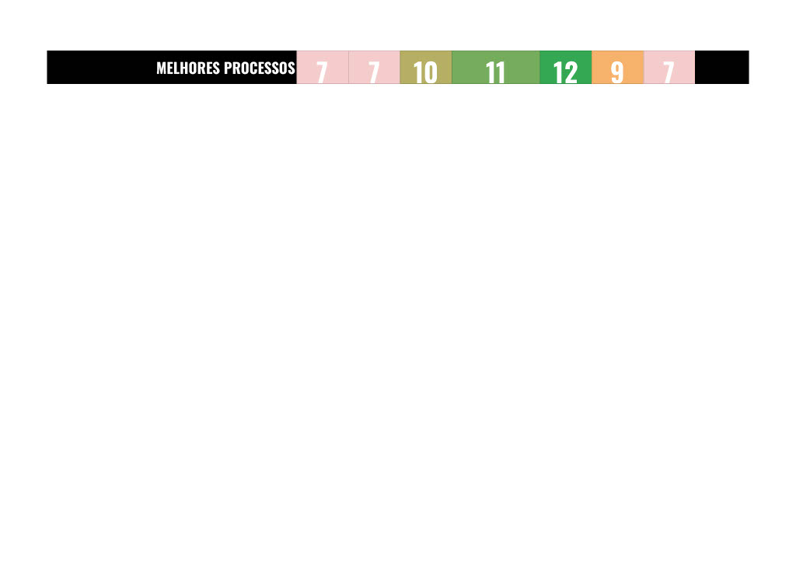

# **3. ESTRATÉGIAS DE ENGENHARIA DE SOFTWARE**

## **3.1 Estratégia Priorizada**

- **Abordagem**: Ágil
- **Ciclo de Vida**: Iterativo e incremental
- **Processo**: Scrum/XP

## **3.2 Quadro Comparativo**

<table border="1">
  <thead style="background-color: #D3D3D3;">
    <tr>
      <th><strong>Características</strong></th>
      <th><strong>RAD</strong></th>
      <th><strong>Scrum/XP</strong></th>
    </tr>
  </thead>
  <tbody>
    <tr>
      <td><strong>Abordagem geral</strong></td>
      <td>Adota formas rápidas com objetivos bem definidos e análise de requisitos extremamente bem alinhada, assim tendo uma abordagem iterativa e incremental.</td>
      <td>Adota uma abordagem iterativa, entregando continuamente pequenas partes do projeto, o que permite ajustes rápidos e feedbacks constantes.</td>
    </tr>
    <tr>
      <td><strong>Foco em arquitetura</strong></td>
      <td>Possui um foco na arquitetura nas fases iniciais, mas o RAD permite flexibilidade ao longo do projeto. </td>
      <td>Possui um foco mais ágil, a arquitetura é evoluída ao longo do projeto. </td>
    </tr>
    <tr>
      <td><strong>Estrutura de Processo</strong></td>
      <td>O RAD segue fases de desenvolvimento </td>
      <td>Sprints curtas e fases. </td>
    </tr>
    <tr>
      <td><strong>Flexibilidade de requisitos</strong></td>
      <td>Permite adaptações e alterações mesmo em fases avançadas do projeto.</td>
      <td>O scrum XP permite uma alta flexibilidade de requisitos, permitindo uma adaptabilidade rápida.</td>
    </tr>
    <tr>
      <td><strong>Colaboração com cliente</strong></td>
      <td>Feedback de maneira constante. Os protótipos são apresentados antecipadamente e com frequência.</td>
      <td>A comunicação é aberta e frequente. Feedback do cliente e da equipe garante que o software esteja no caminho certo.</td>
    </tr>
    <tr>
      <td><strong>Complexidade do processo</strong></td>
      <td>Esforço nas fases iniciais para  definir os requisitos, protótipos e gestão do projeto. </td>
      <td>Busca soluções simples para os problemas de desenvolvimento, facilitando a manutenção e a evolução do software.</td>
    </tr>
    <tr>
      <td><strong>Qualidade Técnica</strong></td>
      <td>Pode ser afetada devido ao foco em velocidade e flexibilidade.</td>
      <td>Alta ênfase na qualidade técnica, com práticas como TDD (Test-Driven Development), pair programming e integração contínua para garantir um código limpo e funcional.</td>
    </tr>
    <tr>
      <td><strong>Práticas de desenvolvimento</strong></td>
      <td>Entregas rápidas e feedbacks.</td>
      <td>Possui programação em pares, Desenvolvimento orientado a testes (TDD), Integração contínua, Refatoração e Jogos de planejamento.</td>
    </tr>
    <tr>
      <td><strong>Adaptação ao Projeto de Panelas Grill</strong></td>
      <td>Projetos que exigem rapidez no desenvolvimento, alta flexibilidade e forte envolvimento do cliente.</td>
      <td>O scrum XP são ideias para projetos com Requisitos insertos </td>
    </tr>
    <tr>
      <td><strong>Documentação</strong></td>
      <td>Documentação leve</td>
      <td>Documentação leve/td>
    </tr>
    <tr>
      <td><strong>Controle de Qualidade</strong></td>
      <td>Pode ser afetada devido ao foco na velocidade.</td>
      <td>As práticas de desenvolvimento como TDD e programação em pares permite um controle de qualidade eficiente. </td>
    </tr>
    <tr>
      <td><strong>Escalabilidade</strong></td>
      <td>O RAD é mais adequado para projetos de pequeno a médio porte, principalmente devido ao seu foco em entregas rápidas e protótipos.</td>
      <td>Escalável, mas mais indicado para equipes menores e médias devido à sua abordagem colaborativa e interativa constante. </td>
    </tr>
    <tr>
      <td><strong>Suporte a Equipes de Desenvolvimento</strong></td>
      <td>O RAD oferece um forte suporte a equipes pequenas e média.</td>
      <td>Suporta equipes menores e mais colaborativas, com papéis mais flexíveis, permitindo maior adaptação ao ritmo do projeto. </td>
    </tr>
  </tbody>
</table>

## **3.3 Justificativa**

Para poder identificar o nosso processo ideal foi feito o GUPTA, o resultado está logo abaixo.

  

  

Com base nos resultados apresentados pelo GUPTA, a equipe optou por adotar o Scrum XP. Além de ser a abordagem recomendada, todos os membros da equipe já possuíam experiência prévia com essa metodologia.

## **3.4 Referências para o quadro comparativo**
<small>DevMedia. Agile Development: XP e Scrum em uma Abordagem Comparativa. Disponível em: <https://www.devmedia.com.br/agile-development-xp-e-scrum-em-uma-abordagem-comparativa/30808>. Acesso em: 23 nov. 2024.</small>

<small>Casa do Desenvolvedor. XP e Scrum: qual método utilizar para gerir seus projetos de software?. Disponível em: <https://blog.casadodesenvolvedor.com.br/xp-scrum/#:~:text=Inspirado%20nas%20pr%C3%A1ticas%20japonesas%20de,ajustes%20r%C3%A1pidos%20e%20feedbacks%20constantes>. Acesso em: 23 nov. 2024.</small>

<small>Ucloud. Metodologia RAD. Disponível em: <https://ucloudglobal.com/br/blog/metodologia-rad/>. Acesso em: 23 nov. 2024.</small>

<small>TreinaWeb. O que é RAD - Rapid Application Development?. Disponível em: <https://www.treinaweb.com.br/blog/o-que-e-rad-rapid-application-development/>. Acesso em: 23 nov. 2024.</small>

## Historico de Versão 
| Data       | Versão | Descrição                                             | Autor      |
|------------|--------|-------------------------------------------------------|------------|
| 10/10/2024 | 1.0    | Documento inicial  | Grupo    |
| 24/10/2024 | 1.1    | Correção dos feedbacks levantados pelo professor  |   Jose Vinicius      |